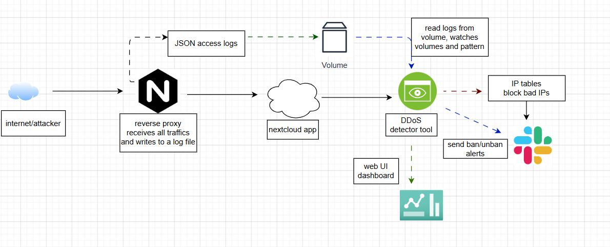
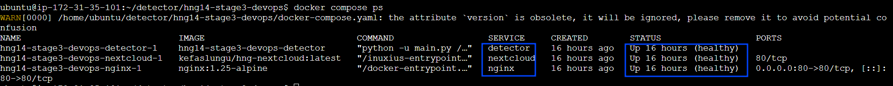
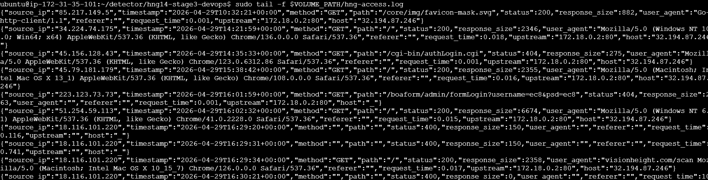
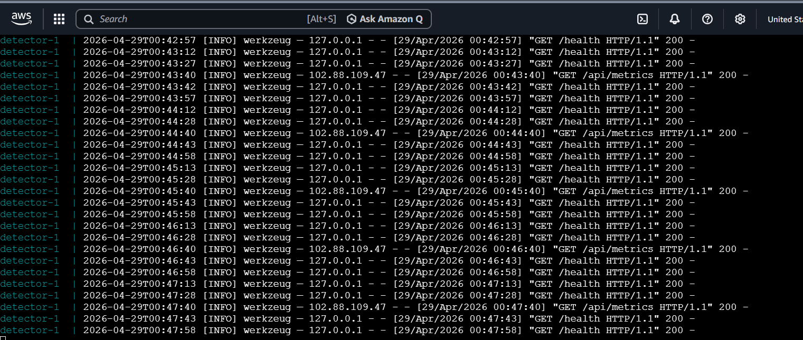

# DDOS Detection Engine - cloud.ng

A Distributed Denial-of-Service (DDoS) attack is a malicious attempt to disrupt normal traffic of a targeted server,
service, or network by overwhelming it with a flood of Internet traffic from multiple, compromised sources (a 
botnet). As such, organizations need to have a system in place that checks for these kinds of attack. This is what 
cloud.ng (DDOS Detection Engine) does to help organizations monitor their system against DDOS attack.

This project is part of HNG14 stage 3 task.

---

## Live Endpoints

| Resource | URL |
|---|---|
| **Server IP** | `32.194.87.246` |
| **Metrics Dashboard** | `http://kemicodes.online:8080` |
| **GitHub Repo** | `https://github.com/cyberar/hng14-stage3-devops` |
| **Blog Post** | `https://adekemiadisa.hashnode.dev/how-i-built-a-real-time-ddos-detection-engine-from-scratch` |

---

## Language Choice - Python

Apart from **Python** being my first choice of language, I chose it for four specific reasons:

1. **`collections.deque`** — Python's built-in double-ended queue is exactly the right data structure for a sliding window. It supports O(1) append and O(1) popleft, meaning evicting old timestamps from the left end of the window costs nothing regardless of window size. A list would cost O(n) for every eviction.

2. **Standard library is sufficient** — the entire daemon uses only `collections`, `threading`, `subprocess`, `math`, and `json` from the standard library. No heavy framework needed for the core logic.

3. **Flask for the dashboard** — a minimal web framework that adds a live metrics HTTP server in under 50 lines without complexity.

4. **Readable detection logic** — the z-score calculation, baseline recalculation, and iptables subprocess calls are all straightforward to read, audit, and modify.

---

## How the Sliding Window Works

### The Data Structure

The detector maintains two deque-based windows to keep track of activities:

```python
from collections import defaultdict, deque

# Per-IP window: one deque per source IP
ip_windows = defaultdict(deque)

# Global window: one deque for all traffic combined
global_window = deque()
```

Each deque stores **timestamps** - one float per request, representing when that request arrived.

> A deque is like a clickboard where every entry can be entered from the right side and when the clipboard gets full, the oldest entry is automatically removed from the left side.

### What Happens on Every Request

```
New request arrives from IP 1.2.3.4 at time T
         |
1. Append T to ip_windows["1.2.3.4"]
   ip_windows["1.2.3.4"] = deque([older times, T-3, T-2, T-1, T])
         |
2. Remove old entries from the LEFT
   cutoff = T - 60   (anything older than 60 seconds)
   while ip_windows["1.2.3.4"][0] < cutoff:
       ip_windows["1.2.3.4"].popleft()
         |
3. Compute rate
   rate = len(ip_windows["1.2.3.4"]) / 60 (request per second)
```

### Eviction Logic

```python
# cutoff = anything older than  60 seconds is too old
cutoff = time.time() - window_seconds   # now - 60

# popleft() removes from the oldest end (left)
while ip_windows[ip] and ip_windows[ip][0] < cutoff:
    ip_windows[ip].popleft()

# After eviction, only the last 60 seconds remain
rate = len(ip_windows[ip]) / window_seconds
```

---

## How the Baseline Works

### Purpose

The baseline answers the question: **"What does normal traffic look like right now?"** so the detector can spot deviations. It cannot be hardcoded because traffic during peak hours is different from traffic off peak hours.

### Window Size

The baseline maintains a rolling **30-minute window** of per-second request counts. Every second is collapsed into a single integer count (not individual timestamps), giving us at most 1,800 data points in memory at any time.

```python
# deque with maxlen automatically evicts the oldest second
_global_window = deque(maxlen=1800)   # 30 min × 60 sec

# Each entry is a tuple: (epoch_second, request_count, error_count)
_global_window.append((1714050001, 42, 3))
```

### Recalculation Interval

Every **60 seconds**, the engine recomputes mean and standard deviation from all entries currently in the window:

```python
counts = [entry[1] for entry in window]         # extract counts
mean   = sum(counts) / len(counts)              # average
variance = sum((x - mean)**2 for x in counts) / len(counts)
stddev   = math.sqrt(variance)                  # population stddev
```

> The standard deviation is what is used to create the z-score. Z-score helps us determine how many deviations away from the normal is the current number. If it is above normal, an alert should be fired.

### Per-Hour Slots

Traffic patterns differ by time of day. The baseline maintains **24 hourly slots** (one per hour of the day) and prefers the current hour's data when it has enough samples:

```python
# hour 0 = midnight, hour 14 = 2pm, etc.
hourly_windows[current_hour].append(entry)

# When recalculating: use current hour's data if available
if len(hourly_windows[current_hour]) >= 60:
    window = hourly_windows[current_hour]   # more relevant
else:
    window = global_window                  # fall back to all data
```

This means the detector uses 2pm traffic patterns to judge 2pm anomalies and not 3am data. This helps to prevent false alarms during peak hours.

### Floor Values

During very quiet periods (e.g. 4am with near-zero traffic), a single burst could produce a z-score of thousands and trigger false positives. Floor values prevent this:

```python
mean   = max(computed_mean,   1.0)   # never below 1.0 req/s
stddev = max(computed_stddev, 1.0)   # never below 1.0
```

### Minimum Samples

The baseline is not trusted until it has collected at least **30 data points**. Before that threshold is crossed, the engine runs on floor values only, it won't fire false positives.

---

## Architecture

```

```

### Module Breakdown

| File | Responsibility |
|---|---|
| `main.py` | Connectts all modules, runs the main loop |
| `monitor.py` | Tails and parses Nginx JSON log line by line |
| `baseline.py` | Rolling 30-min window, per-hour slots, mean/stddev |
| `detector.py` | Deque sliding windows, z-score and multiplier checks |
| `blocker.py` | iptables DROP rules, ban records, offense tracking |
| `unbanner.py` | Background thread releasing expired bans on schedule |
| `notifier.py` | Slack webhook sender with fire-and-forget queue |
| `dashboard.py` | Flask web server serving live metrics |
| `audit.py` | Structured audit log for every ban/unban/recalc |
| `config_loader.py` | Loads config.yaml, resolves environment variables |

---

## Detection Logic

An IP is flagged anomalous if **either** condition fires:

```
z_score = (current_rate - baseline_mean) / baseline_stddev

Condition 1: z_score > 3.0
Condition 2: current_rate > 5× mean
```

The multiplier check catches attacks that arrive so fast that stddev hasn't had time to reflect the new pattern yet.

### Error Surge Tightening

If an IP's 4xx/5xx error rate exceeds 3× the baseline error rate, its z-score threshold is automatically tightened from 3.0 to 2.0, making the detector more sensitive to that IP's traffic.

### Ban Backoff Schedule

| Offense | Duration |
|---|---|
| 1st | 10 minutes |
| 2nd | 30 minutes |
| 3rd | 2 hours |
| 4th+ | Permanent |

---

## Setup Instructions

### 1. Provision the Server

Minimum: 2 vCPU, 2GB RAM, Ubuntu 22.04 LTS. Open ports 22, 80, 443, 8080 in your security group.

### 2. Install Dependencies

```bash
sudo apt update && sudo apt upgrade -y
sudo apt install -y git curl iptables iptables-persistent python3 python3-pip

# Install Docker
sudo apt install docker.io docker-compose -y

# Add docker to the user group so you can use it without having to use sudo
sudo usermod -aG docker $USER
sudo su - <username>
```

### 3. Clone the Repository

```bash
git clone https://github.com/cyberar/hng14-stage3-devops
cd hng14-stage3-devops
```

### 4. Configure Environment Variables

```bash
# Create .env file with your real secrets
cat > .env << 'EOF'
SLACK_WEBHOOK_URL=https://hooks.slack.com/services/YOUR/WEBHOOK/URL
EOF
```

### 5. Create Required Directories

```bash
sudo mkdir -p /var/log/detector
sudo chmod 777 /var/log/detector
```

### 7. Bring Up the Stack

```bash
docker compose up -d --build

# Verify all containers are healthy
docker compose ps
```



### 8. Verify It's Working

```bash
# Check Nginx is writing JSON logs
VOLUME_PATH=$(docker volume inspect hng14-stage3-devops_HNG-nginx-logs \
  --format '{{.Mountpoint}}')
sudo tail -f $VOLUME_PATH/hng-access.log

# Check detector is reading them
docker compose logs detector -f

# Open the dashboard
curl http://localhost:8080/health
```



### 9. Run a Quick Test

```bash
# Install apache benchmark
sudo apt install -y apache2-utils

# Generate baseline traffic
ab -n 100 -c 5 http://localhost/

# Wait 60 seconds, then simulate an attack
ab -n 5000 -c 100 http://localhost/

# Watch the ban fire in the audit log
tail -f /var/log/detector/audit.log
```

---

## Repository Structure

```
hng14-stage3-devops/
├── docker-compose.yml
├── .env.example
├── .gitignore
├── README.md
├── nginx/
│   └── nginx.conf
├── Dockerfile
├── requirements.txt
├── config.yaml
├── main.py
├── monitor.py
├── baseline.py
├── detector.py
├── blocker.py
├── unbanner.py
├── notifier.py
├── dashboard.py
├── audit.py
├── config_loader.py
├── docs/
│   └── architecture.png
└── screenshots/
    ├── tool-running.png
    ├── ban-slack.png
    ├── unban-slack.png
    ├── global-alert-slack.png
    ├── iptables-banned.png
    ├── audit-log.png
    ├── running-containers.png
    ├── access-logs.png
    ├── baseline-graph.png
    ├── baseline-graph-2.png
    └── baseline-graph-3.png
```

---

## Configuration Reference

All thresholds live in `config.yaml`. No code changes needed to tune behaviour.

```yaml
detection:
  z_score_threshold: 3.0      # raise to reduce sensitivity, lower to increase
  rate_multiplier: 5.0        # flag if rate > N× the baseline mean
  error_rate_multiplier: 3.0  # flag on error surge at this multiplier
  tightened_z_score: 2.0      # z-score used when error surge is active

blocking:
  enabled: true               # set false for alert-only mode
  ban_schedule_minutes: [10, 30, 120]
  permanent_after: 3

baseline:
  window_minutes: 30
  recalc_interval: 60
  floor_mean: 1.0
  floor_stddev: 1.0
```